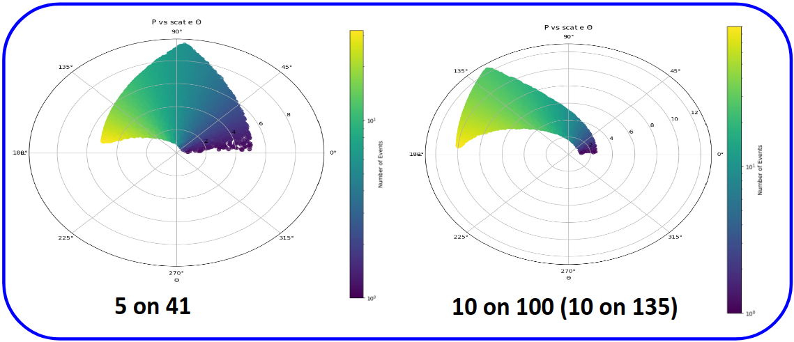
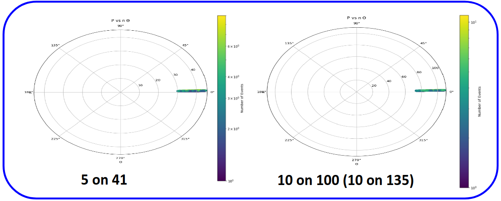
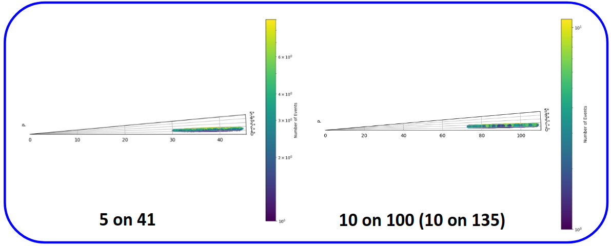

**[Meson working group kinematic coverage](http://www.vsl.cua.edu/cua_phy/index.php/EIC_Meson_Structure_Working_Group)**
===

Generator used: [EIC_mesonMC](https://github.com/JeffersonLab/EIC_mesonMC) <br> 
Kinematic settings: 5 on 41, 10 on 100, and 10 on 135 with a luminosity of 10 $fb^{-1}$
Generator output ROOT and lund files: EIC_mesonMC/eic_SF/OUTPUTS <br> 
More information on running the generator can be found in the [README](../README.ipynb)

**Meson Structure Functions – Scattered Electron**

Scattered electrons can be detected in the central detector <br>
 

**Meson Structure Functions – Scattered Meson**

 

**Meson Structure Functions – Scattered Baryon**

Baryon (neutron, lambda) at very small forward angles and nearly the beam momentum <br>
 

A zoomed version <br>
 

**Script to generate plots**
==

Import packages required for reading in root files and plotting them


```python
%matplotlib inline
import matplotlib as mpl
import matplotlib.pyplot as plt
from matplotlib import interactive
from matplotlib import colors
from ROOT import TFile
import scipy as sc
from scipy import stats
import uproot as up
import numpy as np
import math
```

    Welcome to JupyROOT 6.20/00


Grab the root file of interest to plot. The kinematics is all that needs to be specified.


```python
kinematics = "pi_n_18on275"
# kinematics = "pi_n_10on100"
# kinematics = "pi_n_5on100"
# kinematics = "pi_n_5on41"
# kinematics = "k_lambda_18on275"
rootName = '../OUTPUTS/%s.root' % kinematics
tree = up.open(rootName)["Evnts"]

myfile = TFile(rootName)
mytree = myfile.Get("Evnts")
```

Defines arrays and grabs leaf variables from root file.


```python
scat_electron_theta = []
pion_theta = []
neutron_theta = []

scat_electron_mom = []
pion_mom = []
neutron_mom = []
photon_mom = []

EeE_Lab = tree.array("EeE_Lab")

if "pi" in kinematics:
    xpi = tree.array("xpi")
    EnE_Lab = tree.array("EnE_Lab")
    EpiE_Lab = tree.array("EpiE_Lab")
    ppiz_Lab = tree.array("ppiz_Lab")
if "k" in kinematics:
    xpi = tree.array("xk")
    EnE_Lab = tree.array("ElambE_Lab")
    EpiE_Lab = tree.array("EkE_Lab")
    ppiz_Lab = tree.array("pkz_Lab")
```

A loop that fills arrays with values from particle trees.


```python
for entryNum in range(0,mytree.GetEntries()):
    mytree.GetEntry(entryNum)
    scat_electron = getattr(mytree ,"e_Scat.")
    if "pi" in kinematics:
        pion = getattr(mytree ,"pi.")
    if "k" in kinematics:
        pion = getattr(mytree ,"k.")
    neutron = getattr(mytree ,"p1_Sp.")
    if ppiz_Lab[entryNum] == pion.Z():
        
        pion_theta.append(pion.Theta()*(180/math.pi))
        pion_mom.append(EpiE_Lab[entryNum])
        # pion_mom.append(pion.E())
    
        neutron_theta.append(neutron.Theta()*(180/math.pi))
        neutron_mom.append(EnE_Lab[entryNum])
        # neutron_mom.append(neutron.E())
    
        scat_electron_theta.append(scat_electron.Theta()*(180/math.pi))
        scat_electron_mom.append(EeE_Lab[entryNum])
        # scat_electron_mom.append(scat_electron.E())
        
print("All events collected")
```

    All events collected


Function for polar plot creation.


```python
def polarPlot(theta,r,title,thetalabel,rlabel,thetamin=None,thetamax=None,figure=None,ax=None):
    theta = np.radians(theta)
    xy = np.vstack([theta, r])
    z = sc.stats.gaussian_kde(xy)(xy)
    idx = z.argsort()
    x, y, z = np.array(theta)[idx], np.array(r)[idx], z[idx]
    if ax or figure:
        print("")
    else:
        fig = plt.figure(figsize=(11.69,8.27))
        ax = plt.subplot(111, polar=True)
    hist = ax.scatter(theta, r, c=theta, alpha = 0.75)
    ax.grid(True)
    if thetamin:
        ax.set_thetamin(thetamin)
    if thetamax:
        ax.set_thetamax(thetamax)
    plt.title(title)
    plt.xlabel(thetalabel)
    plt.ylabel(rlabel)

    return fig
```

Produces the polar plots and outputs them to png files. This may take a little while (especially in Jupyter).


```python
f = plt.figure(figsize=(11.69,8.27))
plt.style.use('default')

polar = polarPlot(pion_theta,pion_mom, 'P vs pi $\Theta$','$\Theta$','P')
polar.savefig('pipolar.png')
    
polar = polarPlot(scat_electron_theta,scat_electron_mom, 'P vs scat e $\Theta$','$\Theta$','P')
polar.savefig('epolar.png')
        
polar = polarPlot(neutron_theta,neutron_mom, 'P vs n $\Theta$','$\Theta$','P',0.0,5.0)
polar.savefig('npolar.png')
```
